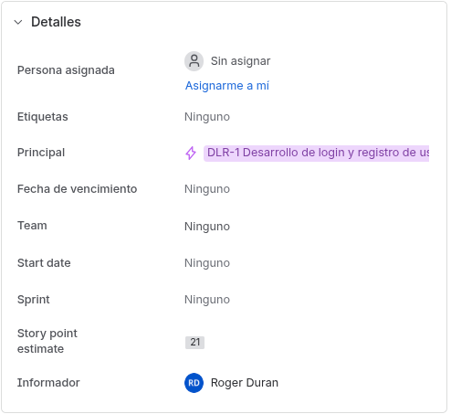
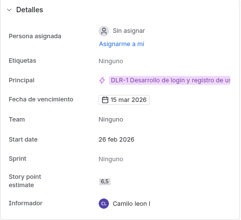
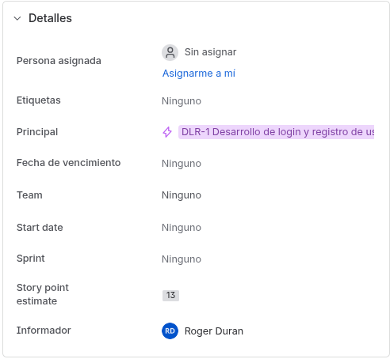
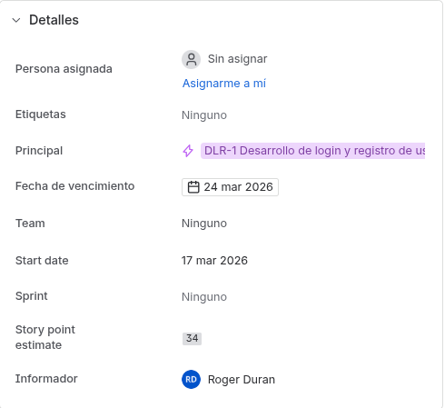

# DOSW_Lab5_RC

## Autores:
- Roger Mauricio Duran Guacaneme
- Camilo Alfonso Leon Acosta

## Roles de trabajo:
- Product Owner: Rodrigo Gualtero (Profesor)
- Scrum Master: Rodrigo Gualtero (Profesor)
- Desarrolladores: Roger Mauricio Duran Guacaneme, Camilo Alfonso Leon Acosta.

## Estimacion por puntos de historia
1. Cual fue la mayor dificultad a la hora de estimar?

    La mayor dificultad a la hora de estimar fue la falta de experiencia en el equipo, lo que hizo que las estimaciones fueran muy imprecisas. Además, la falta de comunicación entre los miembros del equipo también contribuyó a la dificultad para llegar a un consenso sobre las estimaciones.

2. Fue facil llegar a un consenso?

    No, no fue fácil llegar a un consenso. Hubo muchas discusiones y desacuerdos sobre las estimaciones, lo que hizo que el proceso fuera largo y frustrante. Sin embargo, al final logramos llegar a un consenso después de varias rondas de discusión y negociación.

3. Como resolvieron los escenarios donde las estimaciones para la misma historia de usuario no fueran cercanas?

    Para resolver los escenarios donde las estimaciones para la misma historia de usuario no eran cercanas, utilizamos la técnica de planificación de poker. Cada miembro del equipo hizo su estimación de forma independiente y luego compartimos nuestras estimaciones. Si había una gran discrepancia entre las estimaciones, discutimos las razones detrás de cada estimación y tratamos de llegar a un consenso. En algunos casos, decidimos tomar un promedio de las estimaciones para llegar a una cifra final.

## Actualizacion en jira los puntos de historias de usuario
- HU-01: 21 puntos de historia

- HU-02: 6.5 puntos de historia

- HU-03: 13 puntos de historia

- HU-04: 34 puntos de historia

