# 📄 Planeación del Sistema en Jira

## Desglose de trabajo: Épicas, Historias de Usuario y Tareas

La implementación de los requerimientos identificados de Bankify se desglosa de la siguiente manera:

### 1. Épica: Desarrollo de login y registro de usuarios dentro de la aplicación Bankify

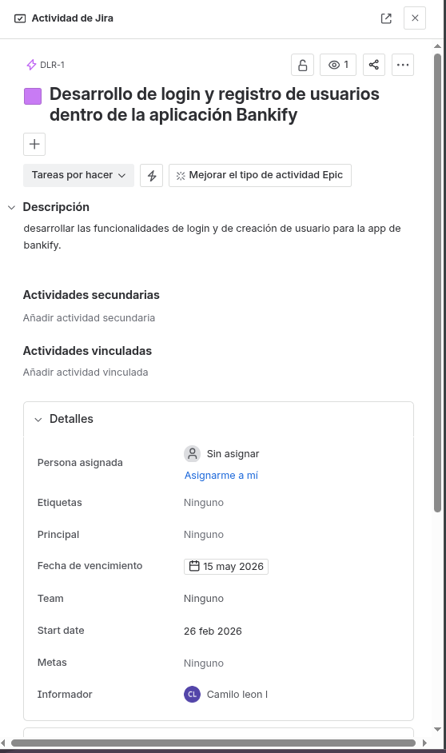

### 2. Historias de usuario: 

1. Desarrollo de login de usuarios

    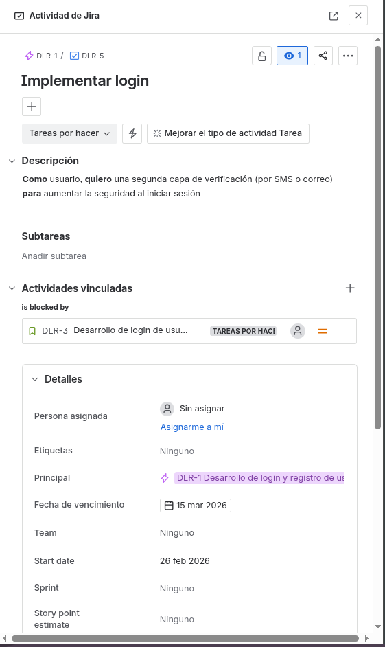

2. Registro de nuevos usuarios

    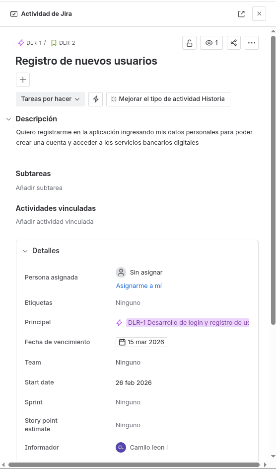

3. Recuperación de contraseña

    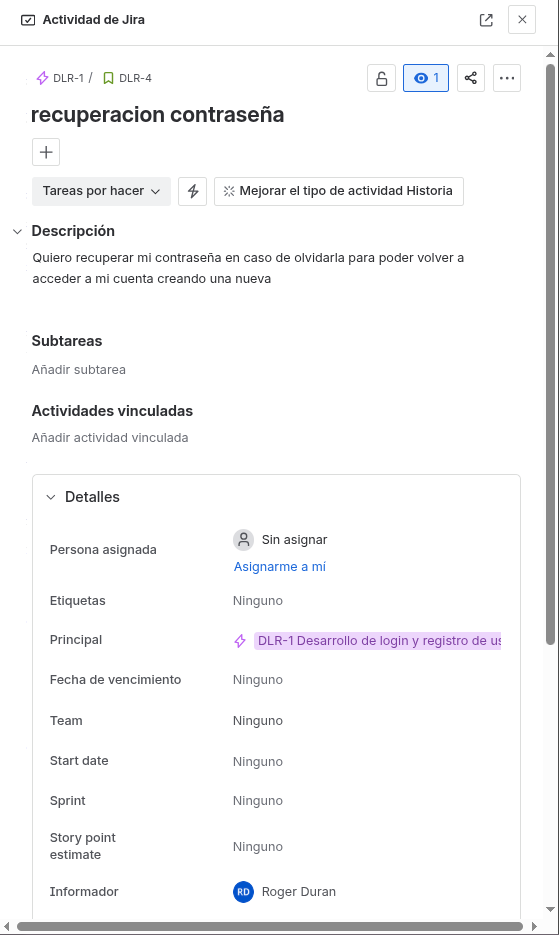

4. Autenticación multifactor (2FA)

    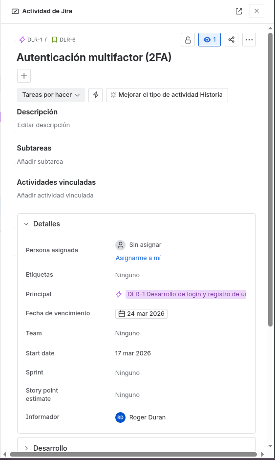

### 3. Tareas:

1. Implementar login (DLR - 5)

    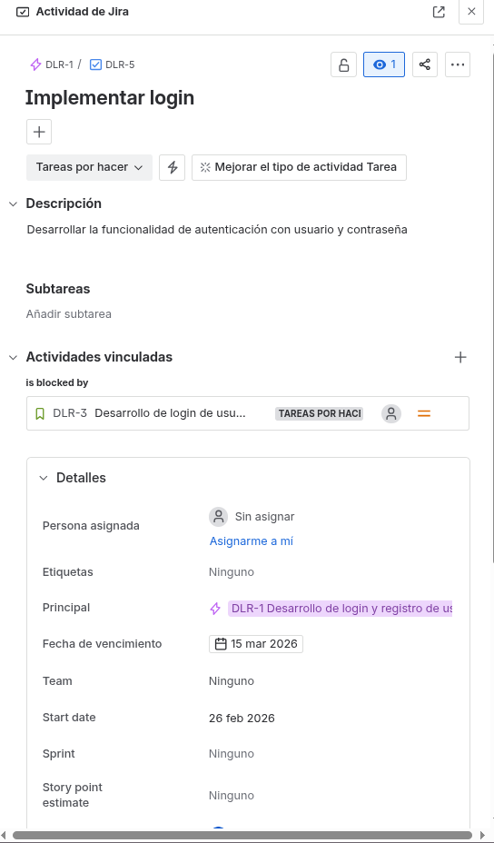

2. Verificar datos de login (DLR - 7)

    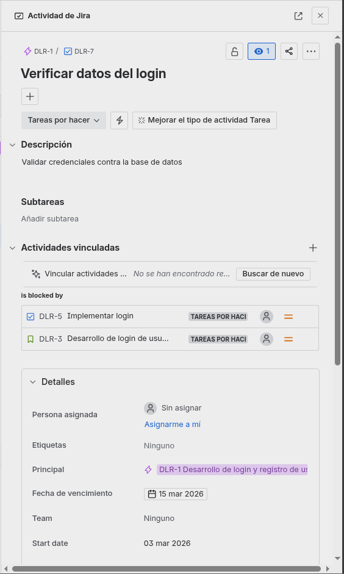

3. Mostrar mensaje de error en login inválido (DLR - 8)

    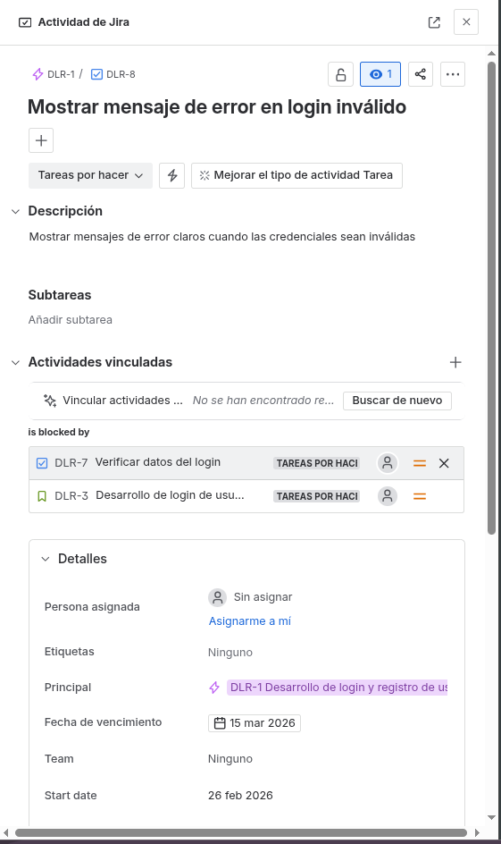

4. Integrar envío de códigos (SMS/Email) (DLR - 15)

    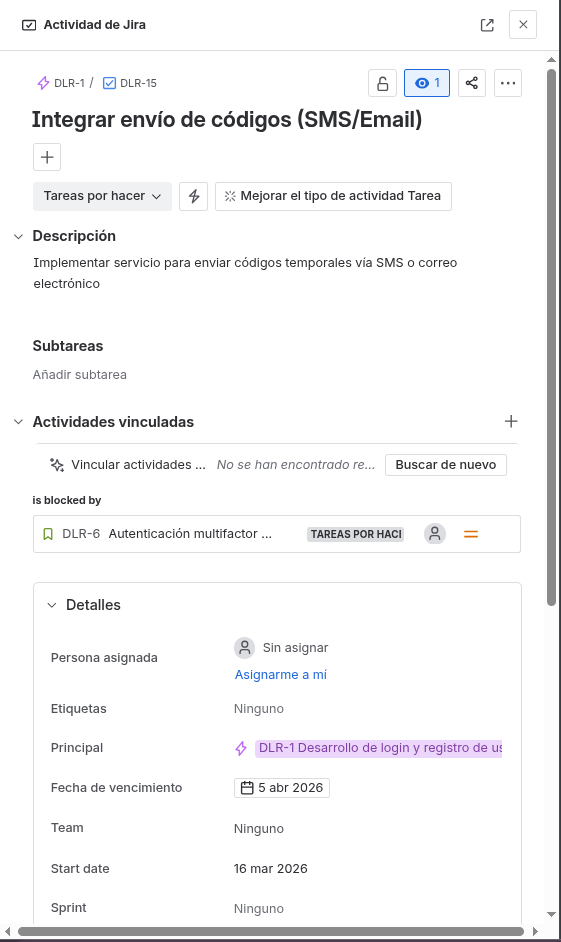

5. Interfaz para ingreso de código 2FA (DLR - 16)

    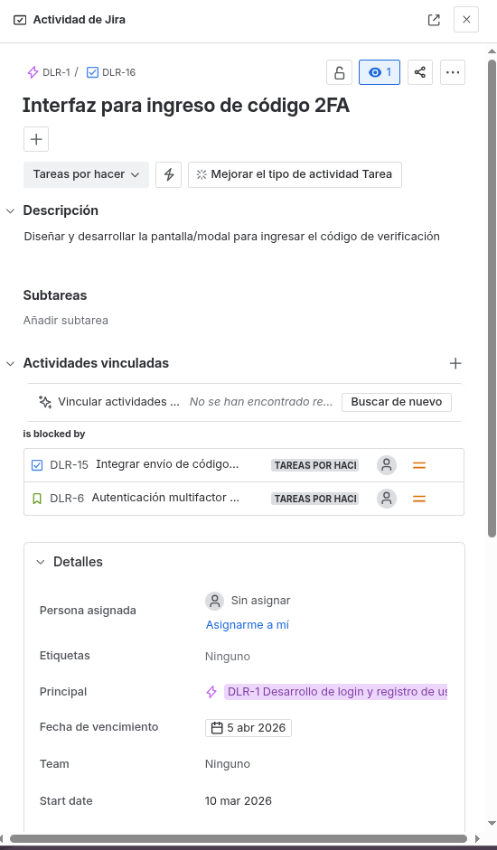

6. Validación y persistencia de preferencias 2FA (DLR - 17)

    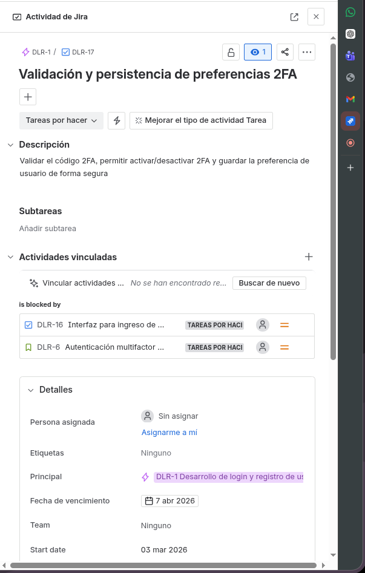

7. Crear formulario para el registro (DLR - 12)

    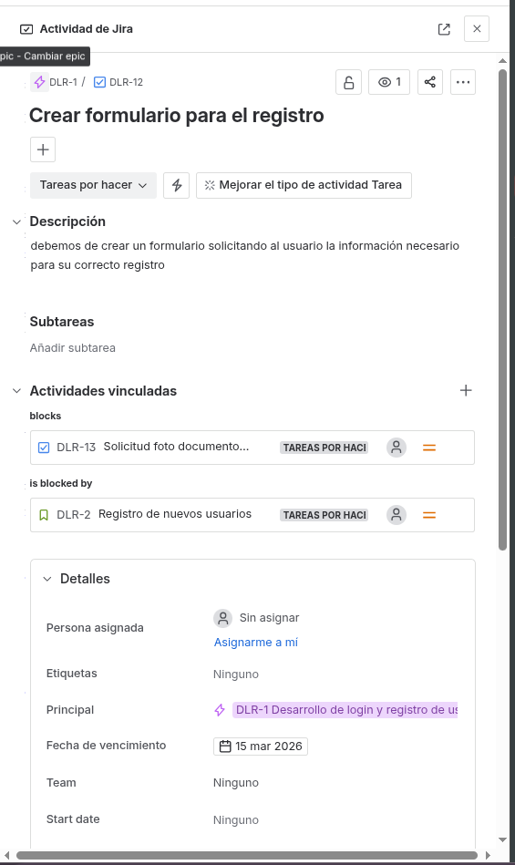

8. Solicitud foto documento identidad (DLR - 13)

    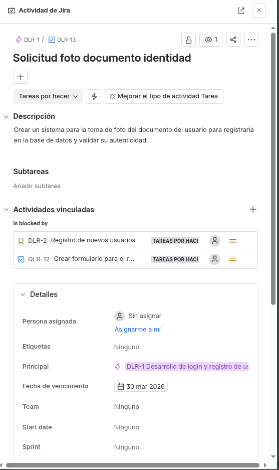

9. Agregar usuario a base de datos (DLR - 14)

    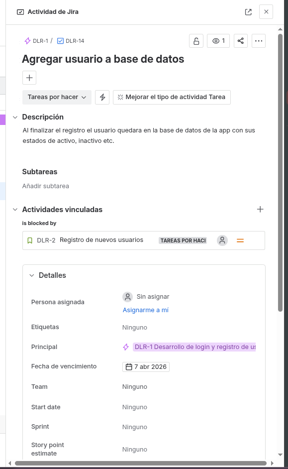

10. Implementar solicitud de recuperación por correo (DLR - 9)

    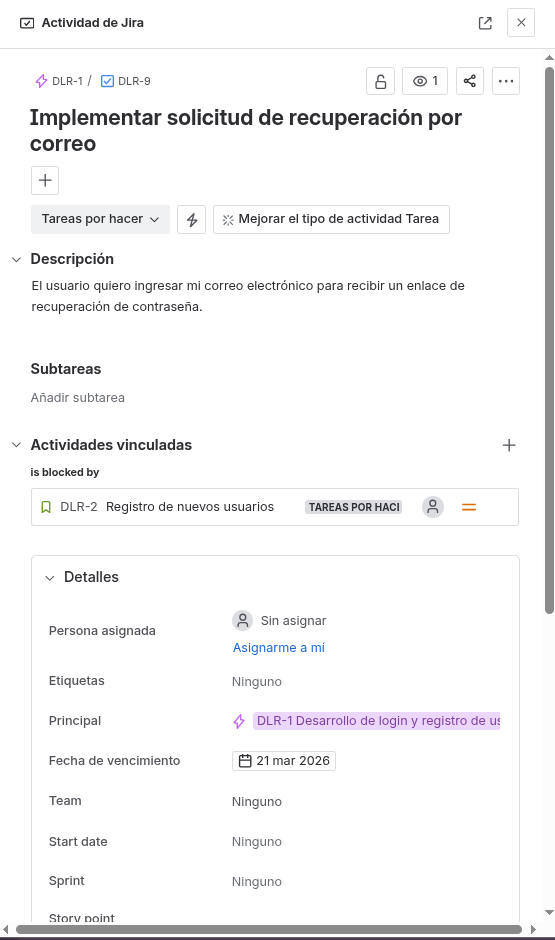

11. Implementar validación de token de recuperación (DLR - 10)

    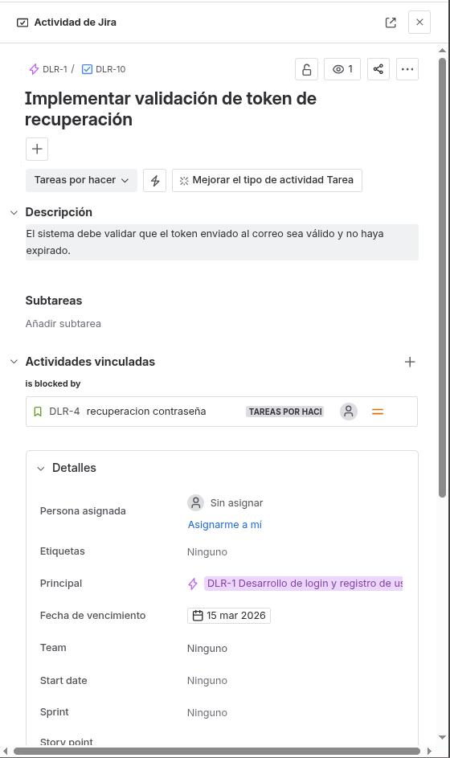

12. Cambio de contraseña segura (DLR - 11)

    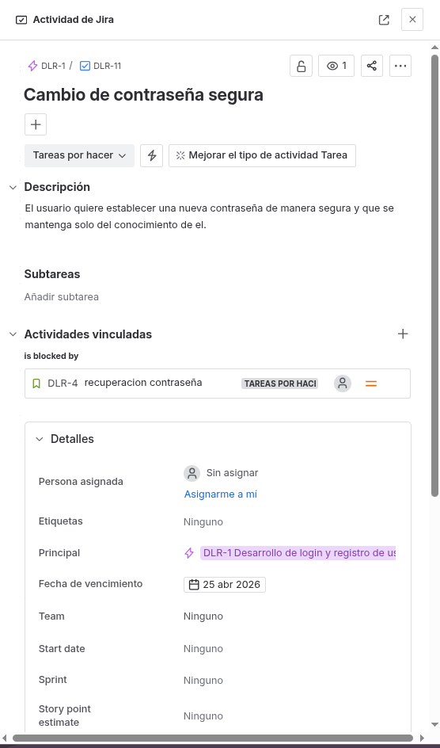

### 4. Cronograma:

    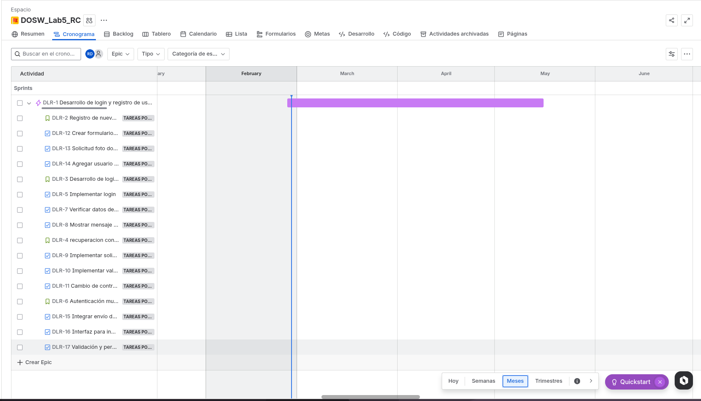

### 5. Backlog:

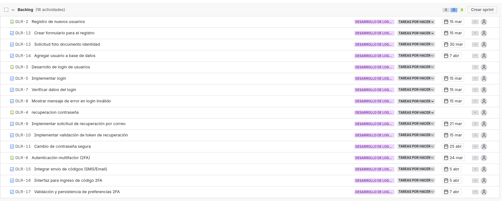